# DPI 自动化测试系统架构文档

## 一、系统架构

DPI 自动化测试系统是一个基于 Excel 用例驱动的自动化测试框架，支持 DPI（深度包检测）设备的安装、升级、模式切换等测试场景。

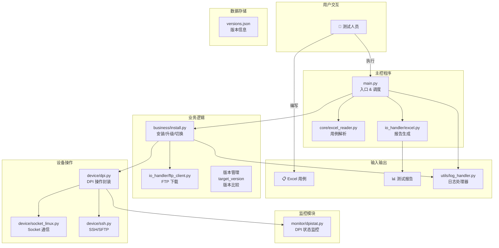

---

## 二、核心业务流程

### 2.1 测试执行总流程

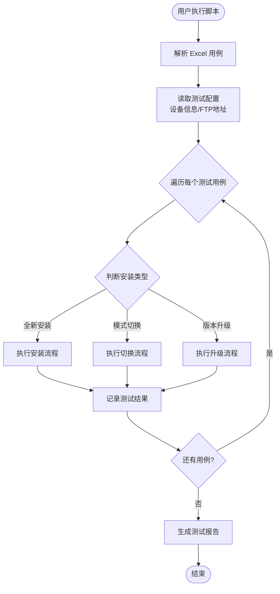

### 2.2 三种测试场景

#### 场景1：全新安装

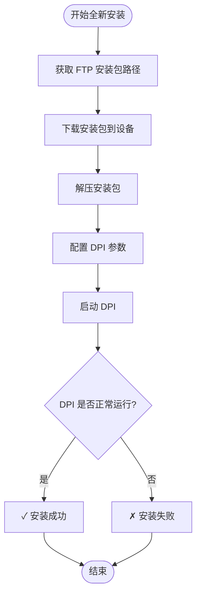

**用例配置示例：**
- 安装类型：全新安装
- dpiversion_d：目标版本号（如 1.0.6.0-1）
- dpimode_d：目标模式（如 idc31）

#### 场景2：模式切换

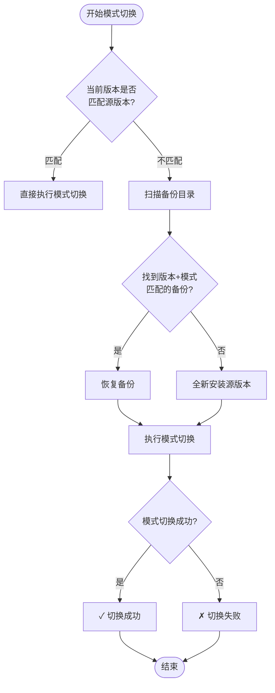

**用例配置示例：**
- 安装类型：模式切换
- dpiversion_s：源版本号（如 1.0.6.0-1）
- dpimode_s：源模式（如 idc31）
- dpimode_d：目标模式（如 idc32）

#### 场景3：版本升级

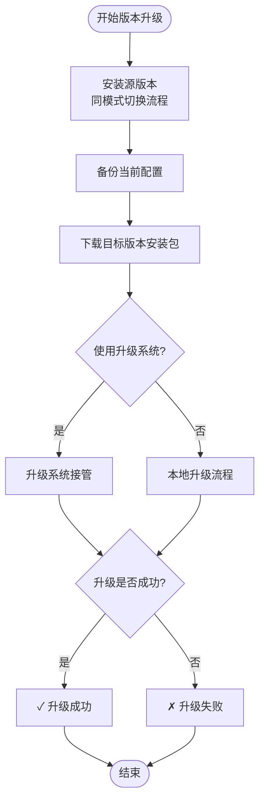

**用例配置示例：**
- 安装类型：升级
- dpiversion_s：源版本号（如 1.0.6.0-1）
- dpiversion_d：目标版本号（如 1.0.6.0-2）
- dpimode_s：源模式（升级不改变模式）

---

## 三、Excel 用例结构

### 3.1 Sheet 组织结构

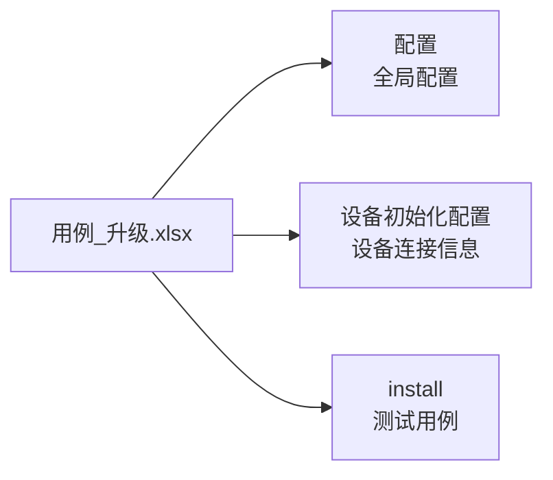

### 3.2 配置 Sheet 示例

| 配置项 | 配置值 |
|--------|--------|
| ftphost | 10.128.5.116 |
| path_dpibak | /home/dpi_backup |
| path_list_scan_dpi | /home/dpi_backup,/tmp/dpi_backup |
| mod_switch_version | idc31 |

### 3.3 设备初始化配置 Sheet 示例

| 配置名称 | 配置类型 | 配置项 | 配置值 |
|----------|----------|--------|--------|
| 设备1 | SSH | ip | 192.168.1.100 |
| 设备1 | SSH | username | root |
| 设备1 | SSH | password | 123456 |

### 3.4 install Sheet 用例字段说明

| 字段名 | 说明 | 示例值 |
|--------|------|--------|
| 执行状态 | 1=执行，其他=跳过 | 1 |
| 安装类型 | 全新安装/模式切换/升级 | 升级 |
| dpiversion_s | 源版本号 | 1.0.6.0-1 |
| dpiversion_d | 目标版本号 | 1.0.6.0-2 |
| dpimode_s | 源模式 | idc31 |
| dpimode_d | 目标模式 | idc32 |
| 优先使用备份dpi_s | 是否优先使用备份 | 是 |
| 优先使用存在安装包_s | 是否优先使用已有安装包（源） | 是 |
| 优先使用存在安装包_d | 是否优先使用已有安装包（目标） | 否 |
| xsa.json预修改 | 预修改配置项 | {"dpi.vlan_multiplexing": 2} |
| switch_param_s | 源版本开关参数 | {"wlan_switch": "1"} |
| switch_param_d | 目标版本开关参数 | {"wlan_switch": "0"} |
| 结果 | 测试结果（自动填写） | Pass/Failed |

---

## 四、版本管理机制

### 4.1 versions.json 文件结构

```json
{
  "信息安全执行单元": {
    "网络安全执行单元V1.0.6.0": {
      "1.0.6.0-1": [
        "ftp://10.128.5.116/.../ACT-DPI-ISE-1.0.6.0-1.tar.gz",
        "ftp://10.128.5.116/.../dev-dpi-1.0.6.0-1.tar.gz"
      ],
      "1.0.6.0-2": [...]
    }
  }
}
```

### 4.2 版本号比较机制

```python
# 支持复杂版本号格式
parse_version("1.0.6.2-4")       # -> (1, 0, 6, 2, 4, 0, 0)
parse_version("1.0.6.0-4-patch-1") # -> (1, 0, 6, 0, 4, 1, 1)

# 标识符权重
letter_weights = {
    'alpha': -3,   # 最低优先级
    'beta': -2,
    'rc': -1,
    'patch': 1     # 正式版以上
}

# 比较示例
compare_versions("1.0.6.0-4", "1.0.6.0-3")  # -> 1 (前者更高)
compare_versions("1.0.6.0-4-alpha", "1.0.6.0-4")  # -> -1
```

### 4.3 target_version 自动获取功能

当配置项使用 `target_version` 时，系统会自动：
1. 读取 `{sheet_name}_target_version_{分类名称}` 配置
2. 连接 RDM 平台获取项目列表
3. 自动获取最高版本号进行替换

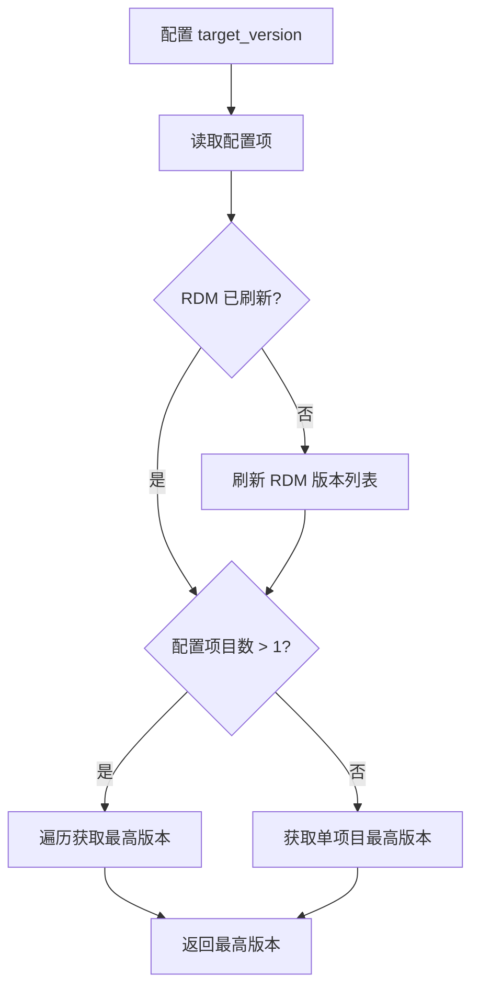

### 4.4 模式到分类的映射

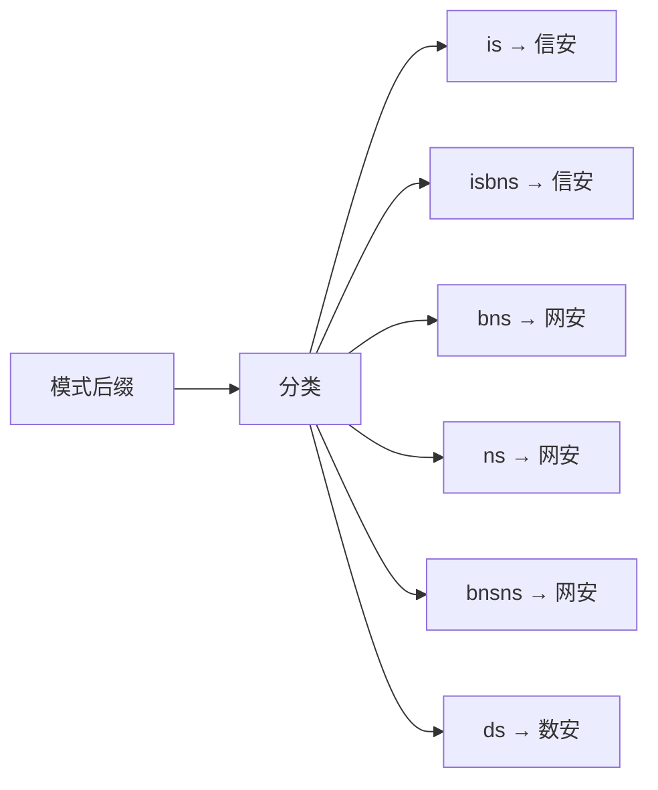

**示例：**
- `com_cmcc_is` → 信息安全执行单元
- `com_cucc_isbns` → 信息安全执行单元
- `com_ctcc_bns` → 网络安全执行单元

---

## 五、关键功能模块

### 5.1 DPI 操作类 (dpi.py)

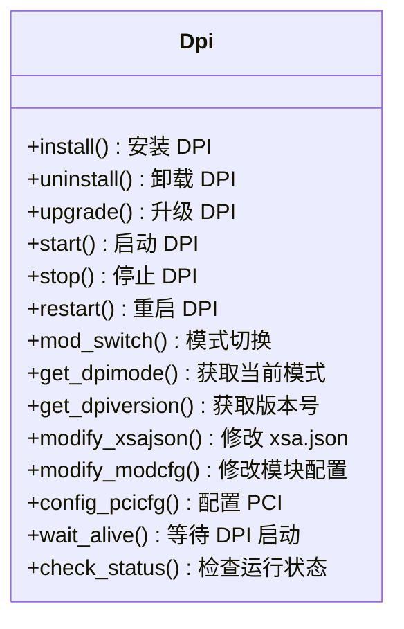

### 5.2 模式切换智能判断 (mod_switch)

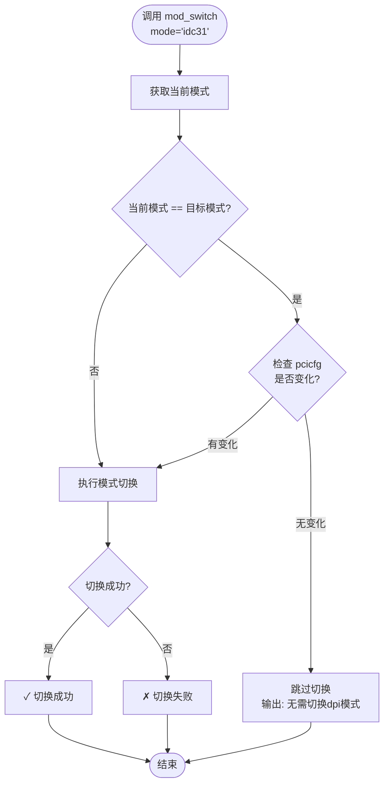

**关键特性：**
- ✅ 自动检测当前模式
- ✅ 模式匹配时智能跳过
- ✅ 支持强制切换（force=True）
- ✅ 支持配置参数变更触发切换

---

## 六、执行方式

### 6.1 命令行执行

```bash
# 执行所有 Sheet
python main.py -f 用例_升级.xlsx

# 执行指定 Sheet
python main.py -f 用例_升级.xlsx -s install

# 生成执行脚本
python main.py -bat  # 生成 .bat 脚本
python main.py -ps1  # 生成 .ps1 脚本
```

### 6.2 脚本执行

```bash
# 执行全量测试
exec_bat\main_exe-用例_升级.xlsx.bat

# 执行单个 Sheet
exec_bat\main_exe-用例_升级.xlsx-install.bat
```

---

## 七、测试报告

### 7.1 报告生成位置

```
report/
└─ 用例_升级_20260409153000.xlsx
```

### 7.2 报告内容

- **原始用例 Sheet**：标记测试结果（Pass/Failed）
- **结果统计 Sheet**：
  - 执行数量
  - 成功数量
  - 失败数量
  - 成功率
  - 执行时间

### 7.3 结果统计示例

| Sheet | 执行数量 | 成功数量 | 失败数量 | 未执行数量 | 成功率 | 执行时间 |
|-------|----------|----------|----------|------------|--------|----------|
| install | 10 | 9 | 1 | 0 | 90.00% | 45 分钟 |

---

## 八、目录结构

```mermaid
graph TD
    A[dpiAutoExcel/] --> B[main.py<br/>主入口]
    A --> C[business/<br/>业务逻辑]
    C --> C1[install.py<br/>安装升级流程]
    A --> D[core/<br/>核心测试逻辑]
    D --> D1[excel_reader.py<br/>用例解析]
    D --> D2[result.py<br/>结果处理]
    D --> D3[comparer.py<br/>结果比对]
    D --> D4[pcap.py<br/>流量回放]
    A --> E[device/<br/>设备通信层]
    E --> E1[dpi.py<br/>DPI 操作封装]
    E --> E2[socket_linux.py<br/>Socket 通信]
    E --> E3[ssh.py<br/>SSH/SFTP]
    A --> F[io_handler/<br/>文件 I/O 处理]
    F --> F1[excel.py<br/>Excel 操作]
    F --> F2[ftp_client.py<br/>FTP 客户端]
    A --> G[monitor/<br/>状态监控]
    G --> G1[dpistat.py<br/>DPI 状态解析]
    A --> H[protocol/<br/>协议处理]
    H --> H1[flow_table.py<br/>流表处理]
    A --> I[data/<br/>数据模型]
    I --> I1[xml_comparer.py<br/>XML 比对]
    I --> I2[dict_comparer.py<br/>字典比对]
    A --> J[utils/<br/>工具模块]
    J --> J1[common.py<br/>通用工具]
    J --> J2[log_handler.py<br/>日志处理]
    A --> K[用例_升级.xlsx<br/>测试用例]
    A --> L[versions.json<br/>版本信息数据库]
    A --> M[log/<br/>日志目录]
    A --> N[report/<br/>测试报告目录]
```

---

## 九、快速开始

### 9.1 环境准备

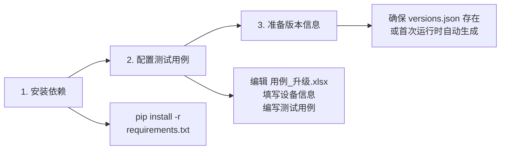

### 9.2 执行测试

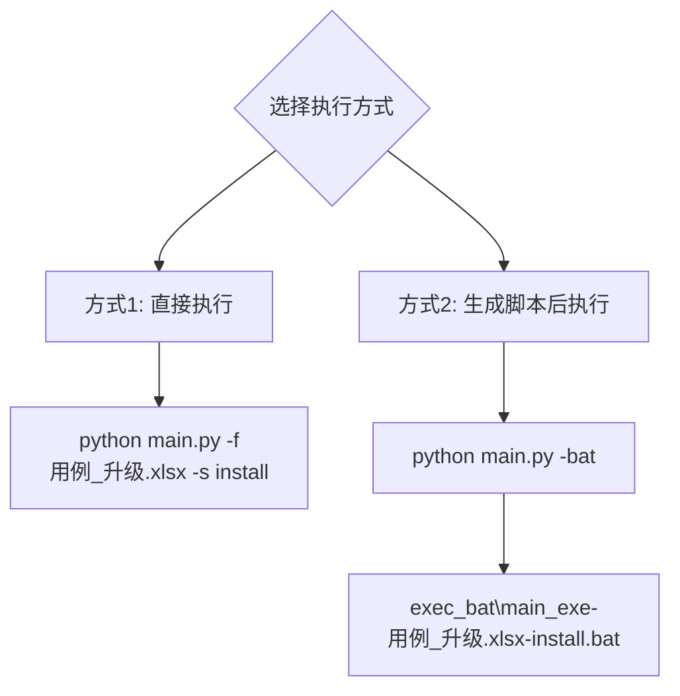

### 9.3 查看结果

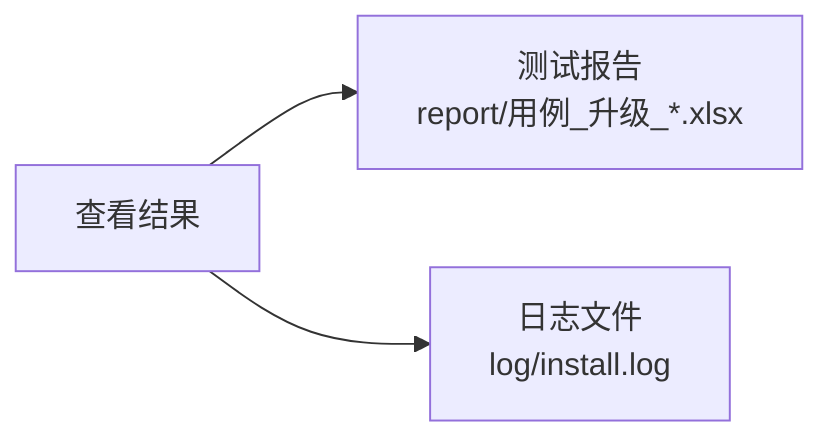

---

## 十、注意事项

### 10.1 版本管理

- ✅ `versions.json` 会自动更新，无需手动维护
- ✅ 版本提取使用系统浏览器（Chrome/Edge），无需额外安装 Chromium
- ✅ 支持多项目版本管理

### 10.2 备份恢复

- ✅ 优先使用备份可加快测试速度
- ✅ 备份目录需包含 `ver.txt` 文件（版本信息）
- ✅ 模式匹配时才会使用备份

### 10.3 模式切换

- ✅ 自动检测当前模式，避免重复切换
- ✅ 支持配置参数变更触发切换
- ✅ 切换失败会自动回滚

---

## 十一、典型用例示例

### 11.1 全新安装用例

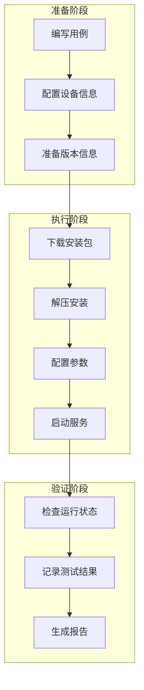

### 11.2 版本升级用例

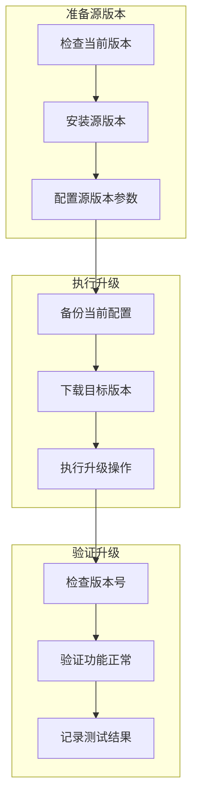

---

## 十一、日志系统架构

### 11.1 日志系统设计

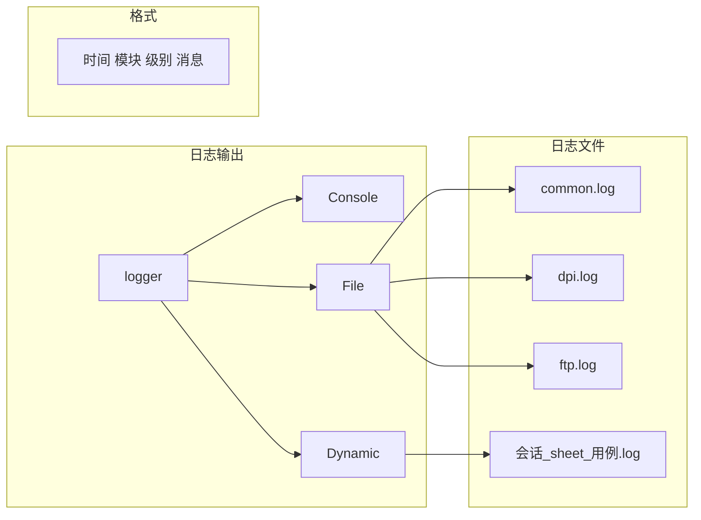

### 11.2 DynamicFileHandler 工作机制

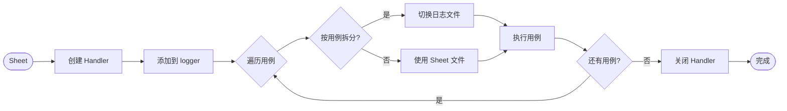

### 11.3 日志文件命名规则

**按用例拆分（install sheet）：**
```
{会话ID}_{sheet名称}_{用例名称}.log
示例：20260411181400_install_信安_安装测试_com_cmcc_is.log
```

**按 Sheet 拆分（upgrade sheet）：**
```
{会话ID}_{sheet名称}.log
示例：20260411181400_upgrade.log
```

**会话ID格式：**
```
YYYYMMDDHHMMSS
示例：20260411181400
```

### 11.4 模块命名规范

| 模块文件 | logger 名称 | 说明 |
|---------|------------|------|
| common.py | common | 通用工具模块 |
| dpi.py | dpi | DPI 操作模块 |
| ftp.py | ftp | FTP 传输模块 |
| dpistat.py | dpistat | DPI 状态检查模块 |
| socket_linux.py | socket_linux | Socket 通信模块 |
| dpiinstall.py | install | 安装/升级主模块 |
| comm.py | comm | 通信模块 |

### 11.5 日志分隔符样式

**用例分隔符：**
```
──────────────────────────────────────────────────────────────────────────────
用例：信安_安装测试_com_cmcc_is
──────────────────────────────────────────────────────────────────────────────
日志文件：20260411181400_install_信安_安装测试_com_cmcc_is.log
```

**阶段分隔符：**
```
╔══════════════════════════════════════════════════════════════════════════════╗
║                           第一阶段：验证 FTP 安装包                           ║
╚══════════════════════════════════════════════════════════════════════════════╝
```

---

## 十二、版本管理系统

### 12.1 版本号解析与比较

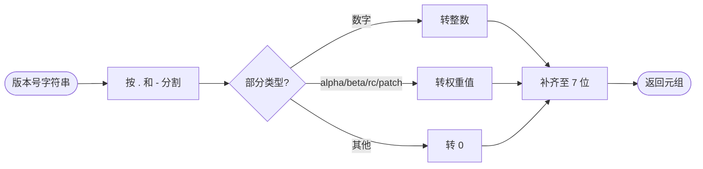

**支持的版本号格式：**
- `1.0.6.2-4` → `(1, 0, 6, 2, 4, 0, 0)` - 正式版
- `1.0.6.0-4-patch-1` → `(1, 0, 6, 0, 4, 1, 1)` - patch 版本
- `1.0.6.0-4-alpha-1` → `(1, 0, 6, 0, 4, -3, 1)` - alpha 版本
- `1.0.6.0-4-beta-2` → `(1, 0, 6, 0, 4, -2, 2)` - beta 版本
- `1.0.6.0-4-rc-1` → `(1, 0, 6, 0, 4, -1, 1)` - rc 版本

### 12.2 target_version 自动获取流程

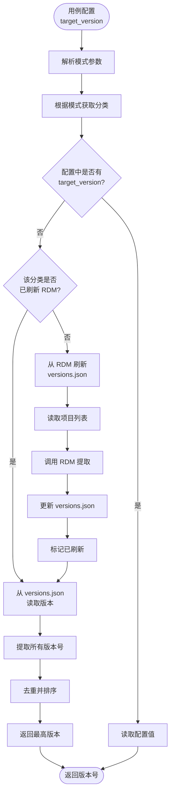

### 12.3 版本号排序示例

```mermaid
graph LR
    A[版本号列表] --> B[解析为元组]
    B --> C[按元组排序]
    C --> D[取最后一个]
    D --> E[最高版本号]
    
    A1["1.0.6.0-4-alpha-1"] --> B
    A2["1.0.6.0-4"] --> B
    A3["1.0.6.2-4"] --> B
    A4["1.0.6.0-4-patch-1"] --> B
    
    E --> E1["1.0.6.2-4"]
```

### 12.4 模式到分类映射

```mermaid
graph LR
    Start([DPI 模式]) --> A[提取模式后缀<br/>最后一个下划线后]
    A --> B{后缀类型?}
    
    B -->|is| C[信息安全执行单元]
    B -->|isbns| C
    B -->|bns| D[网络安全执行单元]
    B -->|ns| D
    B -->|bnsns| D
    B -->|ds| E[数据安全执行单元]
    B -->|其他| F[抛出异常<br/>无法识别的模式]
    
    C --> End([返回分类名称])
    D --> End
    E --> End
    F --> End
```

**映射关系表：**

| 模式后缀 | 分类名称 | 示例模式 |
|---------|---------|---------|
| is | 信息安全执行单元 | com_cmcc_is |
| isbns | 信息安全执行单元 | com_cucc_isbns |
| bns | 网络安全执行单元 | com_ctcc_bns |
| ns | 网络安全执行单元 | com_cmcc_ns |
| bnsns | 网络安全执行单元 | com_cucc_bnsns |
| ds | 数据安全执行单元 | com_cmcc_ds |

### 12.5 配置参数说明

**RDM 凭证配置：**
```
{sheet_name}_install_rdm_username
示例：install_install_rdm_username
值：RDM 平台用户名，默认 weihang

{sheet_name}_install_rdm_password
示例：install_install_rdm_password
值：RDM 平台密码，默认 12345678
```

**FTP 凭证配置：**
```
{sheet_name}_install_ftp_username
示例：install_install_ftp_username
值：FTP 登录用户名，不填默认使用 RDM 用户名

{sheet_name}_install_ftp_password
示例：install_install_ftp_password
值：FTP 登录密码，不填默认使用 RDM 密码
```

**target_version 配置：**
```
{sheet_name}_target_version_{分类名称}
示例：install_target_version_信息安全执行单元
值：1.0.6.3-1 或留空自动获取
```

**projects 配置：**
```
{sheet_name}_projects_{分类名称}
示例：install_projects_信息安全执行单元
值：项目名称列表，换行分隔
```

---

**文档版本：** v2.3
**更新日期：** 2026-04-19
**适用系统：** DPI 自动化测试系统
