# DPI 自动化测试系统逻辑流程文档

## 一、总体执行流程

### 1.1 主流程概览

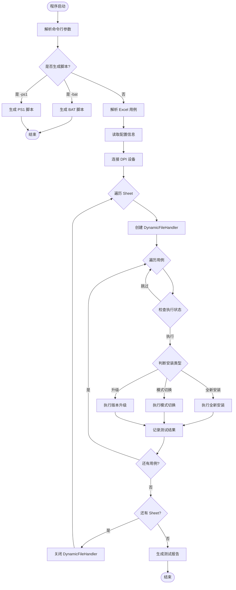

---

## 二、版本路径获取流程

### 2.1 FTP 路径获取逻辑

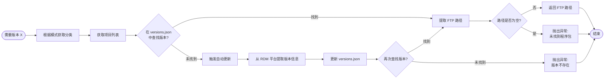

### 2.2 模式到分类映射

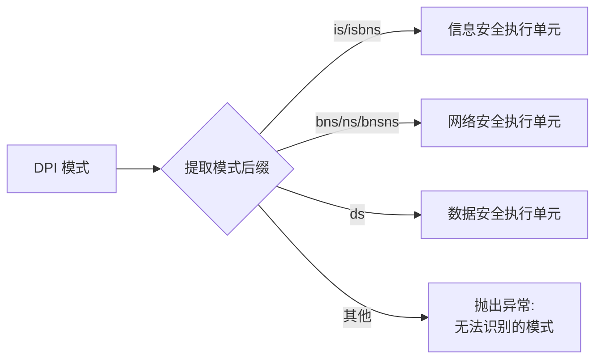

---

## 三、全新安装流程

### 3.1 全新安装完整流程

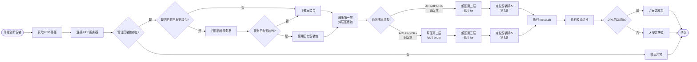

### 3.2 安装包解压逻辑

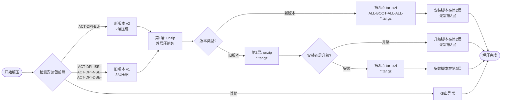

---

## 四、模式切换流程

### 4.1 模式切换完整流程

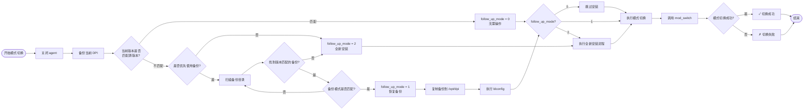

### 4.2 mod_switch 智能判断

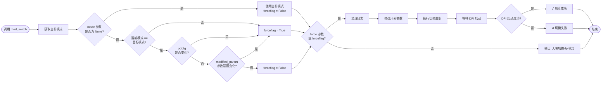

---

## 五、版本升级流程

### 5.1 版本升级完整流程

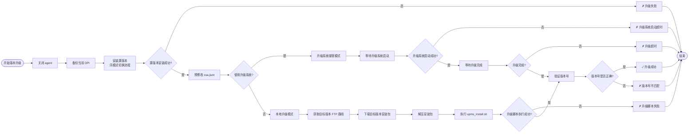

### 5.2 升级系统接管流程

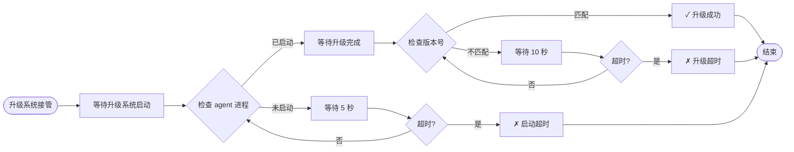

---

## 六、备份恢复机制

### 6.1 备份扫描流程

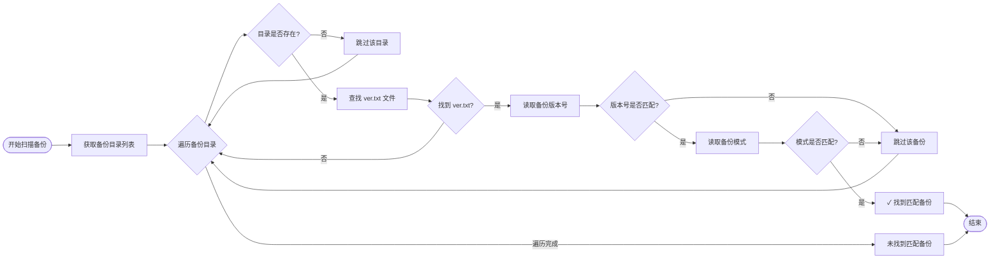

### 6.2 备份恢复流程


---

## 七、DPI 安装包处理

### 7.1 安装包下载流程

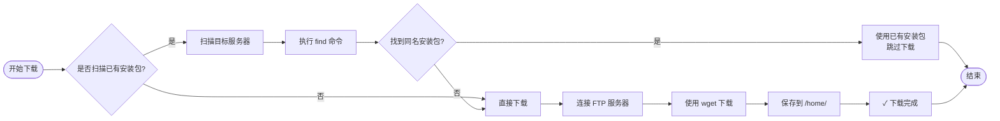

### 7.2 版本类型识别

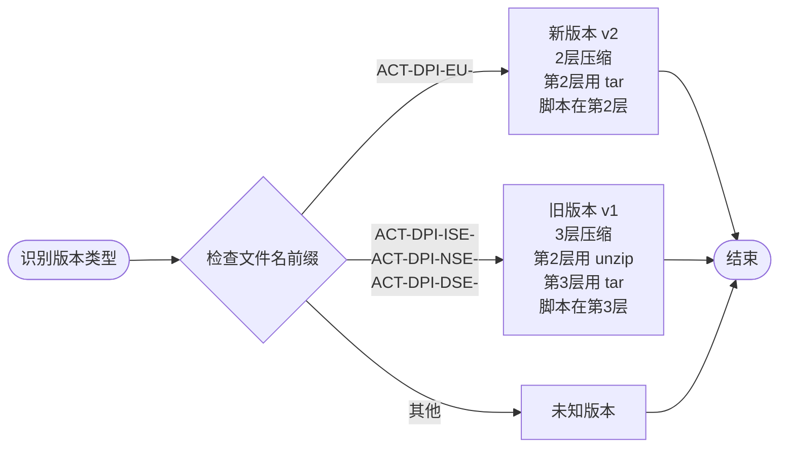

---

## 八、测试结果处理

### 8.1 结果记录流程

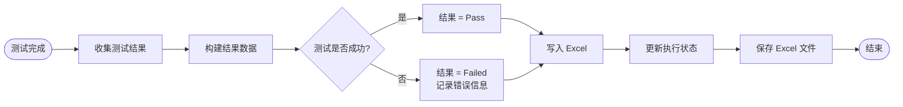

### 8.2 报告生成流程


---

## 九、异常处理机制

### 9.1 异常处理流程

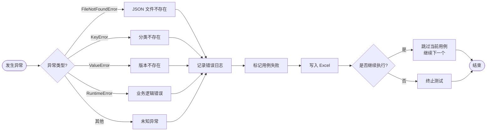

### 9.2 错误恢复策略

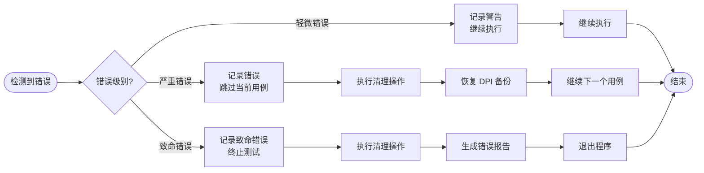

---

## 十、关键决策点

### 10.1 安装类型决策

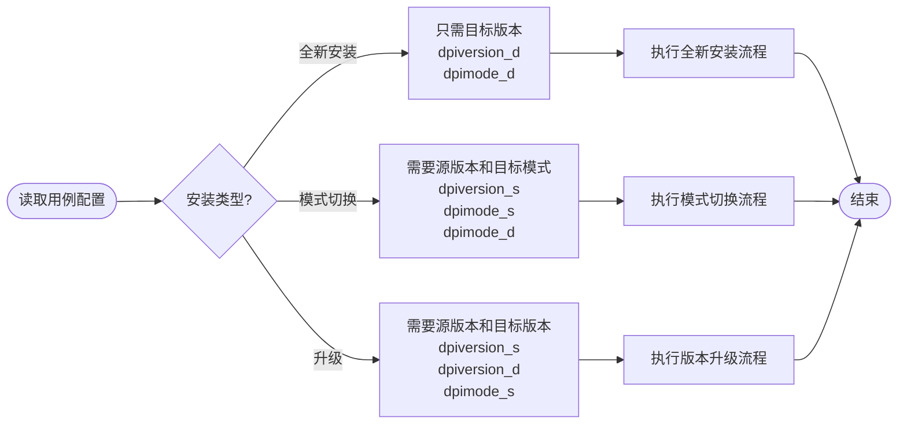

### 10.2 备份使用决策

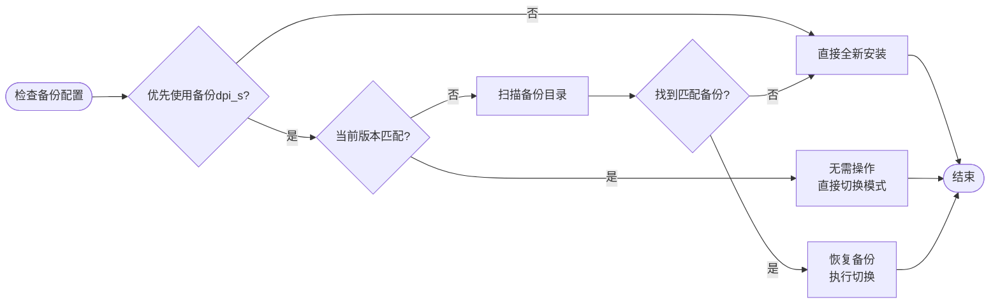

### 10.3 安装包复用决策

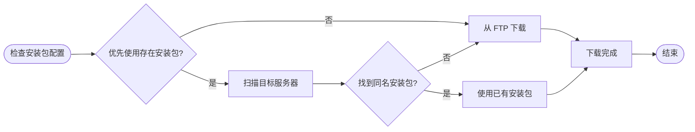

---

## 十一、配置参数处理

### 11.1 xsa.json 预修改流程

```mermaid
graph LR
    Start([读取预修改配置]) --> A{配置是否为空?}
    A -->|是| B[跳过修改]
    A -->|否| C[解析配置字符串]

    C --> D[转换为字典]
    D --> E[读取 xsa.json]
    E --> F[合并配置]
    F --> G[写入 xsa.json]
    G --> H[✓ 修改完成]

    B --> End([结束])
    H --> End
```

### 11.2 开关参数处理流程

```mermaid
graph LR
    Start([读取开关参数]) --> A{参数是否为空?}
    A -->|是| B[使用默认参数]
    A -->|否| C[解析参数字符串]

    C --> D[转换为字典]
    D --> E[读取 mod_switch.sh]
    E --> F[修改开关值]
    F --> G[写入 mod_switch.sh]
    G --> H[✓ 修改完成]

    B --> End([结束])
    H --> End
```

---

## 十二、RDM 平台数据提取流程

### 12.1 单项目提取主流程

```mermaid
graph LR
    Start([开始提取]) --> A[启动浏览器]
    A --> B{选择浏览器类型}
    B -->|Chrome| C[使用 Chrome]
    B -->|Edge| D[使用 Edge]
    B -->|Chromium| E[使用 Chromium]

    C --> F[创建浏览器上下文]
    D --> F
    E --> F

    F --> G[登录 RDM 平台]
    G --> H[提取项目数据]
    H --> I{提取成功?}

    I -->|是| J[二次处理数据]
    I -->|否| K[返回错误信息]

    J --> L[返回处理结果]
    K --> L

    L --> M[关闭浏览器]
    M --> End([结束])
```

### 12.2 多项目提取主流程

```mermaid
graph LR
    Start([开始提取多个项目]) --> A[启动浏览器]
    A --> B[登录 RDM 平台<br/>仅登录一次]

    B --> C[初始化结果字典]
    C --> D{遍历项目列表}

    D --> E[提取单个项目数据]
    E --> F{提取成功?}

    F -->|是| G[保存到结果字典]
    F -->|否| H[记录错误日志]

    G --> I{还有下一个项目?}
    H --> I

    I -->|是| J[返回首页]
    J --> K{返回成功?}
    K -->|是| D
    K -->|否| L[警告: 无法返回首页]
    L --> D

    I -->|否| M[关闭浏览器]
    M --> N[返回所有结果]
    N --> End([结束])
```

### 12.3 RDM 平台登录流程

```mermaid
graph LR
    Start([开始登录]) --> A[访问 RDM 平台]
    A --> B[填写用户名]
    B --> C[填写密码]
    C --> D[点击登录按钮]
    D --> E[等待网络空闲]
    E --> F[等待 2 秒]
    F --> G[✓ 登录成功]
    G --> End([结束])
```

### 12.4 单项目详细提取流程

```mermaid
graph LR
    Start([开始提取项目]) --> A[点击 home 图标展开菜单]
    A --> B{点击项目管理}

    B -->|成功| C[等待页面加载]
    B -->|失败| D[重试: 再次点击 home]
    D --> B

    C --> E[在 iframe 中查找项目链接]
    E --> F{找到项目?}

    F -->|精确匹配| G[点击项目链接]
    F -->|部分匹配| H[使用项目名前缀匹配]
    F -->|失败| I[刷新页面重试]

    H --> G
    I --> E

    G --> J[等待跳转到详情页]
    J --> K[查找 entityTab frame]

    K --> L{找到 frame?}
    L -->|否| M[等待后重试]
    M --> K
    L -->|是| N[点击提测申请标签]

    N --> O{点击成功?}
    O -->|ID定位成功| P[等待列表加载]
    O -->|失败| Q[尝试文本定位]
    Q --> P

    P --> R[查找列表 frame]
    R --> S{找到 frame?}

    S -->|belongList.jsf| T[使用 belongList frame]
    S -->|list.jsf| U[使用 list frame]
    S -->|遍历查找| V[查找包含表格的 frame]

    T --> W[获取 HTML 内容]
    U --> W
    V --> W

    W --> X[解析 HTML]
    X --> Y[提取发布路径数据]
    Y --> Z{数据有效?}

    Z -->|是| AA[✓ 提取成功]
    Z -->|否| AB[返回空数据]

    AA --> End([结束])
    AB --> End
```

### 12.5 HTML 解析流程

```mermaid
graph LR
    Start([开始解析 HTML]) --> A[使用 BeautifulSoup 解析]
    A --> B[查找表头表格<br/>class: head-table]

    B --> C{找到表头?}
    C -->|否| D[抛出异常: 未找到表头]

    C -->|是| E[获取第二行表头]
    E --> F[遍历所有列]

    F --> G{列名是什么?}
    G -->|Name| H[记录标题列索引]
    G -->|Fld_A_00031| I[记录发布路径列索引]
    G -->|ProjectID| J[记录所属项目列索引]

    H --> F
    I --> F
    J --> F

    F --> K{所有列都找到?}
    K -->|否| L[抛出异常: 缺少必要列]

    K -->|是| M[查找数据表格<br/>class: body-table]
    M --> N[获取所有数据行]

    N --> O{遍历每一行}
    O --> P[获取所属项目文本]
    P --> Q{项目名称匹配?}

    Q -->|否| O
    Q -->|是| R[提取标题和发布路径]

    R --> S{标题是否已存在?}
    S -->|是| T{新路径是否为空?}
    S -->|否| U[直接添加数据]

    T -->|是| V[保持原有路径]
    T -->|否| W[替换为新路径]

    V --> O
    W --> O
    U --> O

    O -->|遍历完成| X{数据是否为空?}
    X -->|是| Y[返回错误: 未提取到记录]
    X -->|否| Z[✓ 返回数据]

    Z --> End([结束])
    Y --> End
    D --> End
    L --> End
```

### 12.6 版本号处理流程

```mermaid
graph LR
    Start([开始二次处理]) --> A[初始化处理结果字典]
    A --> B{遍历原始数据}

    B --> C[按逗号分割路径]
    C --> D[过滤空路径]

    D --> E{路径列表是否为空?}
    E -->|是| F[跳过该记录]
    E -->|否| G[从第一个路径提取版本号]

    G --> H{版本号正则匹配}
    H -->|匹配 EU-版本号_202| I[提取版本号]
    H -->|匹配 ISE-版本号_202| I
    H -->|不匹配| J[跳过该记录]

    I --> K{版本号是否已存在?}
    K -->|否| L[创建新版本号列表]
    K -->|是| M[追加到已有列表]

    L --> N{遍历所有路径}
    M --> N

    N --> O{路径是否已存在?}
    O -->|是| P[跳过重复路径]
    O -->|否| Q[添加到列表]

    P --> N
    Q --> N

    N -->|遍历完成| B
    F --> B
    J --> B

    B -->|遍历完成| R[返回处理结果]
    R --> End([结束])
```

### 12.7 JSON 文件保存流程

```mermaid
graph LR
    Start([开始保存]) --> A[检测数据格式]
    A --> B{单项目还是多项目?}

    B -->|单项目| C[格式: version: paths]
    B -->|多项目| D[格式: project: version: paths]

    C --> E[读取现有 JSON 文件]
    D --> E

    E --> F{文件是否存在?}
    F -->|否| G[创建新文件]
    F -->|是| H{文件是否损坏?}

    H -->|是| I[备份损坏文件]
    H -->|否| J[读取现有数据]

    I --> G
    G --> J

    J --> K[获取该分类的旧数据]
    K --> L{遍历新数据}

    L --> M{版本是否存在?}
    M -->|否| N[记录为新版本]
    M -->|是| O[对比路径集合]

    O --> P{路径是否有变化?}
    P -->|是| Q[记录变更详情<br/>added_paths<br/>removed_paths]
    P -->|否| R[记录为未变化版本]

    N --> S[统计变更数量]
    Q --> S
    R --> S

    S --> L
    L -->|遍历完成| T[新数据覆盖旧数据]
    T --> U[写入 JSON 文件]
    U --> V[返回对比结果]
    V --> End([结束])
```

### 12.8 版本对比详细流程

```mermaid
graph LR
    Start([开始对比版本]) --> A[获取旧版本路径集合]
    A --> B[获取新版本路径集合]

    B --> C[计算新增路径<br/>new_set - old_set]
    C --> D[计算删除路径<br/>old_set - new_set]

    D --> E{是否有变化?}
    E -->|新增或删除| F[记录到 updated_versions]
    E -->|完全相同| G[记录到 unchanged_versions]

    F --> H[生成变更详情]
    H --> I[added_paths: 新增路径列表]
    I --> J[removed_paths: 删除路径列表]
    J --> K[更新 updated_count]

    G --> L[更新 unchanged_count]

    K --> End([结束])
    L --> End
```

### 12.9 返回首页重试机制

```mermaid
graph LR
    Start([需要返回首页]) --> A{第几次尝试?}

    A -->|第1次| B[使用 goto 方法<br/>超时: 30秒]
    A -->|第2次| C[使用 goto 方法<br/>超时: 60秒]

    B --> D{成功?}
    C --> D

    D -->|是| E[✓ 返回首页成功]
    D -->|否| F{第1次失败?}

    F -->|是| G[尝试点击 home 图标]
    F -->|否| H[✗ 返回首页失败]

    G --> I{成功?}
    I -->|是| E
    I -->|否| C

    E --> End([结束])
    H --> J[警告: 可能影响下一个项目]
    J --> End
```

---

## 十三、性能优化点

### 13.1 安装包复用机制

- ✅ 扫描目标服务器已有安装包
- ✅ 跳过重复下载
- ✅ 检查已解压目录，跳过重复解压

### 13.2 备份恢复机制

- ✅ 优先使用备份，避免重复安装
- ✅ 版本+模式精确匹配
- ✅ 快速恢复，节省时间

### 13.3 智能跳过机制

- ✅ 模式匹配时跳过切换
- ✅ 版本匹配时跳过安装
- ✅ 配置无变化时跳过修改

### 13.4 RDM 数据提取优化

- ✅ 多项目共享一次登录
- ✅ 智能重试机制（home图标、项目管理、项目链接）
- ✅ 多种 frame 查找策略（belongList、list、遍历查找）
- ✅ 失败时不保存错误数据，只记录日志

---

## 十四、日志系统流程

### 14.1 日志系统初始化流程

```mermaid
graph LR
    Start([程序启动]) --> A[各模块导入]
    A --> B[调用 setup_logging]
    B --> C[创建 logger]
    C --> D[设置日志级别 DEBUG]
    D --> E[禁用日志传播<br/>propagate = False]
    E --> F[清空已有 handlers]
    F --> G[创建 FileHandler<br/>模块日志文件]
    G --> H[创建 ConsoleHandler<br/>控制台输出]
    H --> I[设置统一格式<br/>时间 模块 级别 消息]
    I --> End([初始化完成])
```

### 14.2 DynamicFileHandler 生命周期

```mermaid
graph LR
    Start([Sheet 开始]) --> A[创建 DynamicFileHandler<br/>log_dir=log]
    A --> B[设置日志级别 DEBUG]
    
    B --> C[遍历所有模块]
    C --> D{模块是否有 logger?}
    D -->|是| E[移除原有 FileHandler]
    E --> F[添加 DynamicFileHandler]
    D -->|否| G[跳过该模块]
    
    F --> H{还有模块?}
    G --> H
    H -->|是| C
    H -->|否| I{日志拆分策略?}
    
    I -->|按 Sheet| J[创建 Sheet 日志文件]
    I -->|按用例| K[等待用例开始]
    
    J --> L[执行 Sheet 用例]
    K --> L
    
    L --> M{还有用例?}
    M -->|是| N{按用例拆分?}
    N -->|是| O[切换到用例日志文件]
    N -->|否| P[继续使用当前文件]
    O --> Q[执行用例]
    P --> Q
    Q --> M
    
    M -->|否| R[遍历所有模块]
    R --> S[移除 DynamicFileHandler]
    S --> T[关闭 DynamicFileHandler]
    T --> End([Sheet 结束])
```

### 14.3 日志文件切换流程

```mermaid
graph LR
    Start([需要切换日志文件]) --> A[接收新文件路径]
    A --> B{是否为相对路径?}
    B -->|是| C[添加 log/ 前缀]
    B -->|否| D[使用绝对路径]
    
    C --> E{文件路径是否变化?}
    D --> E
    
    E -->|否| F[跳过切换]
    E -->|是| G[flush 当前 handler]
    
    G --> H[关闭当前 handler]
    H --> I[创建新 FileHandler]
    I --> J[设置日志级别 DEBUG]
    J --> K[设置日志格式]
    K --> L[更新当前文件路径]
    L --> End([切换完成])
    
    F --> End
```

### 14.4 日志输出流程

```mermaid
graph LR
    Start([产生日志消息]) --> A[调用 logger.info/warning/error]
    A --> B[创建 LogRecord]
    B --> C{logger 是否禁用传播?}
    
    C -->|是| D[仅处理当前 logger 的 handlers]
    C -->|否| E[传播到父 logger]
    
    D --> F[遍历 handlers]
    E --> F
    
    F --> G{handler 类型?}
    
    G -->|ConsoleHandler| H[输出到控制台<br/>级别: INFO+]
    G -->|FileHandler| I[输出到模块日志文件<br/>级别: DEBUG+]
    G -->|DynamicFileHandler| J[输出到当前日志文件<br/>级别: DEBUG+]
    
    H --> K[格式化日志]
    I --> K
    J --> K
    
    K --> L[应用格式: 时间 模块 级别 消息]
    L --> M[写入目标]
    M --> End([输出完成])
```

### 14.5 用例分隔符打印流程

```mermaid
graph LR
    Start([用例开始]) --> A[调用 print_case_separator]
    A --> B[打印空行]
    B --> C[打印横线分隔符<br/>─ * 78]
    C --> D[打印用例名称<br/>用例: {case_name}]
    D --> E[打印横线分隔符<br/>─ * 78]
    E --> F{是否提供日志文件?}
    F -->|是| G[打印日志文件路径<br/>日志文件: {log_file}]
    F -->|否| H[跳过]
    G --> End([分隔符打印完成])
    H --> End
```

### 14.6 阶段分隔符打印流程

```mermaid
graph LR
    Start([阶段开始]) --> A[调用 print_stage_separator]
    A --> B[打印空行]
    B --> C[打印上边框<br/>╔═*78╗]
    C --> D[计算阶段名称显示宽度<br/>中文字符占2宽度]
    D --> E[计算左右填充空格]
    E --> F[打印阶段名称<br/>║ 文本 ║]
    F --> G[打印下边框<br/>╚═*78╝]
    G --> End([分隔符打印完成])
```

### 14.7 日志清理机制

```mermaid
graph LR
    Start([程序结束]) --> A[遍历所有模块]
    A --> B{模块是否有 logger?}
    B -->|是| C[遍历 logger 的 handlers]
    B -->|否| D[跳过该模块]
    
    C --> E{handler 类型?}
    E -->|DynamicFileHandler| F[flush handler]
    E -->|其他| G[跳过]
    
    F --> H[关闭 handler]
    H --> I[从 logger 移除 handler]
    
    G --> I
    I --> J{还有 handler?}
    J -->|是| C
    J -->|否| K{还有模块?}
    
    D --> K
    K -->|是| A
    K -->|否| End([清理完成])
```

---

## 十五、版本管理流程

### 15.1 target_version 自动获取流程

```mermaid
graph TD
    Start([用例配置<br/>target_version]) --> A[调用 resolve_version_target]
    A --> B{版本号是否为<br/>target_version?}
    
    B -->|否| C[直接返回原版本号]
    B -->|是| D[根据模式获取分类<br/>get_category_by_mode]
    
    D --> E[构建配置参数名称<br/>sheet_target_version_分类]
    E --> F{配置中是否有值?}
    
    F -->|是| G[返回配置值]
    F -->|否| H{该分类是否已<br/>刷新过 RDM?}
    
    H -->|是| I[从 versions.json<br/>读取所有版本]
    H -->|否| J[读取项目列表配置]
    
    J --> K[调用 RDM 提取函数]
    K --> L[更新 versions.json]
    L --> M[标记分类已刷新]
    M --> I
    
    I --> N[提取所有版本号]
    N --> O[去重]
    O --> P[版本号排序<br/>get_highest_version]
    P --> Q[返回最高版本]
    
    G --> End([返回实际版本号])
    C --> End
    Q --> End
```

### 15.2 版本号解析流程

```mermaid
graph TD
    Start([版本号字符串]) --> A[按 . 和 - 分割]
    A --> B{遍历每个部分}
    
    B --> C{部分类型判断}
    C -->|纯数字| D[转换为整数]
    C -->|alpha/beta/rc/patch| E[转换为权重值<br/>alpha=-3, beta=-2<br/>rc=-1, patch=1]
    C -->|其他| F[转换为 0]
    
    D --> G[添加到 parts 列表]
    E --> G
    F --> G
    
    G --> H{parts 长度 < 7?}
    H -->|是| I[补齐 0]
    H -->|否| J[返回元组]
    
    I --> H
    J --> End([返回可比较元组])
```

### 15.3 版本号比较流程

```mermaid
graph LR
    Start([两个版本号]) --> A[解析为元组<br/>parse_version]
    A --> B[比较元组大小]
    
    B --> C{v1 < v2?}
    C -->|是| D[返回 -1]
    C -->|否| E{v1 > v2?}
    
    E -->|是| F[返回 1]
    E -->|否| G[返回 0]
    
    D --> End([比较结果])
    F --> End
    G --> End
```

### 15.4 最高版本获取流程

```mermaid
graph LR
    Start([版本号列表]) --> A[检查列表是否为空]
    A -->|是| B[返回空字符串]
    A -->|否| C[使用 sorted 排序<br/>key=parse_version]
    
    C --> D[取最后一个元素]
    D --> E[返回最高版本]
    
    B --> End([最高版本号])
    E --> End
```

### 15.5 模式到分类映射流程

```mermaid
graph TD
    Start([DPI 模式]) --> A{模式是否为 None?}
    A -->|是| B[抛出异常<br/>模式不能为 None]
    A -->|否| C[提取模式后缀<br/>最后一个下划线后]
    
    C --> D{后缀在映射表中?}
    D -->|是| E[返回对应分类]
    D -->|否| F[抛出异常<br/>无法识别的模式]
    
    E --> End([分类名称])
    B --> End
    F --> End
```

---

**文档版本：** v1.2
**更新日期：** 2026-04-11
**适用系统：** DPI 自动化测试系统
